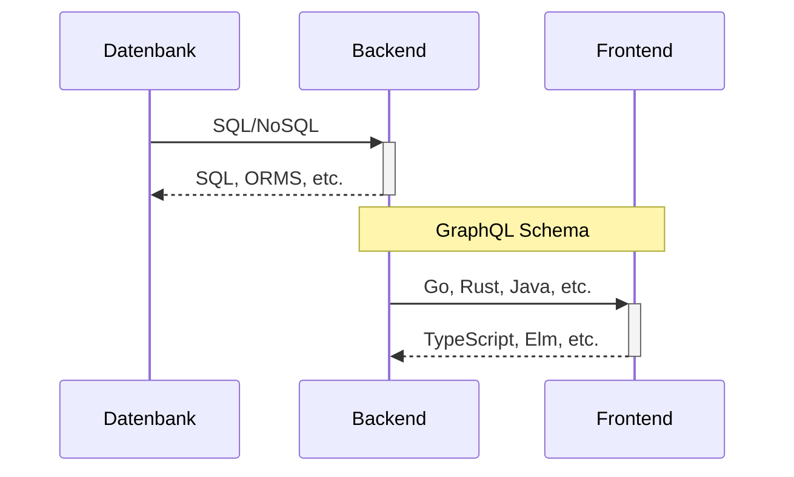
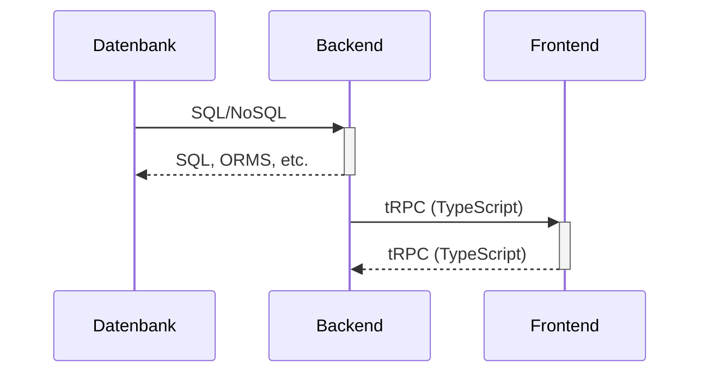

trpc

# Durchgängige Typsichere APIs

<div class="abs-br m-6 flex gap-2">
  <button @click="$slidev.nav.openInEditor()" title="Open in Editor" class="text-xl icon-btn opacity-50 !border-none !hover:text-white">
    <carbon:edit />
  </button>
  <a href="https://github.com/sophiabrandt/webworker-hannover-meetup-trpc-talk" target="_blank" alt="GitHub"
    class="text-xl icon-btn opacity-50 !border-none !hover:text-white">
    <carbon-logo-github />
  </a>
</div>

---

Sophia Brandt

<div>
<a href="https://www.newcubator.com" target="_blank" alt="Newcubator"
class="text-xl icon-btn opacity-50 !border-none !hover:text-black">
Software-Entwicklerin @newcubator GmbH</a>
</div>

<div>
<a href="https://twitter.com/hisophiabrandt" target="_blank" alt="Twitter"
class="text-xl icon-btn text-blue opacity-50 !border-none !hover:text-blue">
<carbon-logo-twitter />@hisophiabrandt</a>
</div>

<div>
<a href="https://www.rockyourcode.com" target="_blank" alt="blog"
class="text-xl icon-btn text-cyan-600 opacity-50 !border-none !hover:text-cyan-600">
<bi-vector-pen/>www.rockyourcode.com</a>
</div>

<ul>
<li class="text-sm">TypeScript</li>
<li class="text-sm">Go</li>
<li class="text-sm">Kommandozeile: (Neo)Vim, Tmux, Fish Shell</li>
<li class="text-sm">Esperanto 💚</li>
</ul>

---

Slides:


[](https://webworker-hannover-meetup-trpc-talk.vercel.app/)

<div>
<a href="https://webworker-hannover-meetup-trpc-talk.vercel.app/" target="_blank" alt="wiki icon"
class="text-xl icon-btn opacity-50 !border-none !hover:text-black">
<carbon-wikis />Link</a>
</div>

---

trpc

## [https://trpc.io](https://trpc.io)

---

was & wozu? ✅

---

full-stack TypeScript

---

automatische Typsicherheit

---

Framework-unabhängig

---

Developer Experience

---

leichtgewichtig

---

Fernzugriff auf den BackendCode

---

🚫 Schema

🚫 Sprache (Query Language)

---

Keine Codegenerierung

---

"reduziertes REST"

---

"nur Funktionen"

---

Offboarding-Pfad

---

# T3 Stack Demo

```ts
pnpm dlx create-t3-app@latest
```

---

tRPC
❌

---

nur: TS Monorepos

---

nicht für APIs für Drittanbieter

---

andere Programmiersprachen als TS

---

TS Development Performance

(viele Endpunkte)

---

Support für alles außer React

(React Query)

---

🥊 trpc vs GraphQL

---

GraphQL

---

Schema Definition

---

geteilte Sprache zwischen Backend & Frontend

---

löst

Kommunikations-/

Organisationsprobleme

---



---



---

gRPC?

---

remote procedure calls

---

Hat **nichts** mit tRPC zu tun

---

Kommunikation zwischen Servern

(verteilte Systeme)

---

trpc?

---

Kommunikation zwischen BE & FE

---

Slides:


[](https://webworker-hannover-meetup-trpc-talk.vercel.app/)

<div>
<a href="https://webworker-hannover-meetup-trpc-talk.vercel.app/" target="_blank" alt="wiki icon"
class="text-xl icon-btn opacity-50 !border-none !hover:text-black">
<carbon-wikis />Link</a>
</div>
